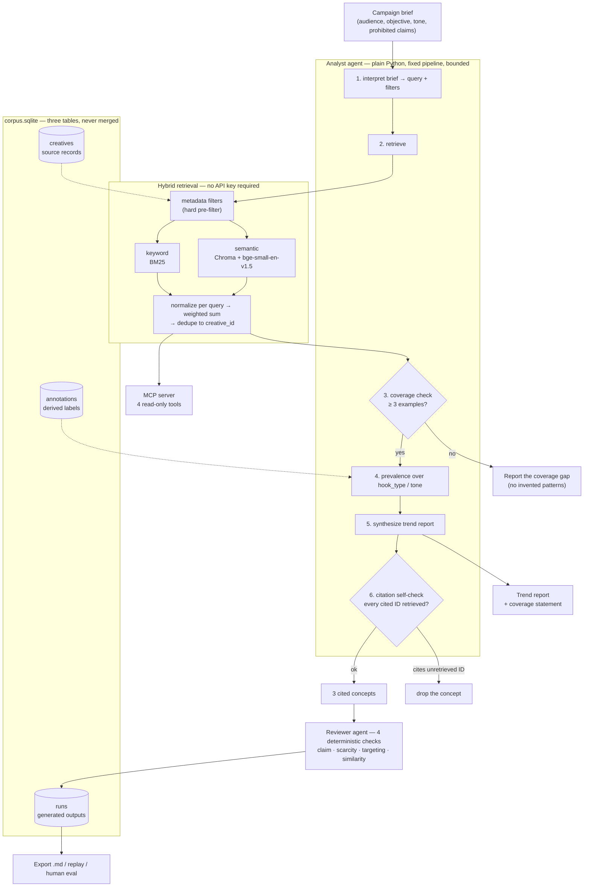

# Architecture

## System diagram

## The three design claims

### 1. The retrieval unit is a record, not a chunk (§8)

There is no chunking anywhere. Each creative is indexed under **two representations** pointing at one `creative_id`:

- **Creative card** — deterministic assembly of schema fields. Free, always available, matches literal vocabulary (ingredient names, product names, offer language).
- **Analyst summary** — an LLM characterization of *what the ad does*. Matches strategist vocabulary that appears nowhere in the ad's own copy.

Concretely: the query *"authority-led moisturizer"* retrieves the moisturizer ad with semantic score 1.000 and BM25 score 0.000 — the ad copy contains none of those words. That is the pair doing the job it was chosen for.

Because one creative can match twice, **fusion dedupes to `creative_id` and keeps the max component score** (Entry #10) — summing would let the two-representation design inflate its own ranking against the single-representation baseline it is measured against.

### 2. Lineage is enforced by table separation (§6)

| Table | Holds | Written by |
|---|---|---|
| `creatives` | Observed facts + deterministic derivations | Ingest only |
| `annotations` | Labels a model exercised judgment on, with `annotator` and `confidence` | Bootstrap / LR / LLM escalation |
| `runs` | Generated outputs — reports, concepts, reviews | The agent |

The dividing line between the first two is **"did a model exercise judgment"**, not "was this computed" (Entry #3). `days_active` and `proxy_bucket` are computed, but deterministically and reproducibly from `start_date` / `date_observed`, so they live in `creatives` beside their inputs. Nothing derived or generated is ever written back into `creatives`.

### 3. The honesty rule is a gate, not prompt wording

Four places it is mechanical rather than aspirational:

| Where | Enforcement |
|---|---|
| Citation self-check | A concept citing an unretrieved ID is **dropped**, not flagged |
| Coverage floor | Below 3 examples, the agent reports the gap instead of producing patterns |
| Insight rules | Rendered through `rule_claim()`; a test forbids performance vocabulary in its output |
| MCP payloads | Honesty rule + coverage statement travel *inside* the JSON, since there is no UI footer out there |

## Agent design

**Plain Python, no framework.** Agents are functions with Pydantic-typed tools. The fixed pipeline (the Section 4 V0) was chosen over a dynamic agent deliberately: a fixed order produces the same trace shape every run, which keeps the "How this was produced" expander legible and makes eval regressions attributable to the pipeline rather than to the model's tool-ordering whim (Entry #14).

Bounds: `MAX_TOOL_CALLS = 8` (the pipeline uses 5), `MIN_COVERAGE = 3`, exactly one clarifying question, then it proceeds.

**Tracing is one structure with two renderings.** `AgentTrace` feeds both the UI expander and Phoenix spans. Two separately-maintained logs could disagree; one cannot.

**The reviewer is deterministic and independent.** No LLM call, so it runs with no API key and returns the same verdict every time — required for the planted-violation test to be meaningful, and a reviewer whose verdict drifts run-to-run is not a control. It re-reads the concept against the retrieved evidence rather than trusting the generator's account of itself.

## Two clients, one tool layer

`agents/tools.py` is wrapped twice — by the Streamlit app and by the MCP server. The MCP surface is read-only, enforced at the driver (`file:...?mode=ro`), not by convention. That is the interoperability claim: same corpus, same code, queried from an app and from someone else's coding agent.

## What runs without an API key

Everything except generation: ingest, indexing, all retrieval, the entire reviewer, the insight tree, and all four MCP tools. This is a hard constraint from §7 — a grader must be able to reproduce retrieval with no vendor account at all.
